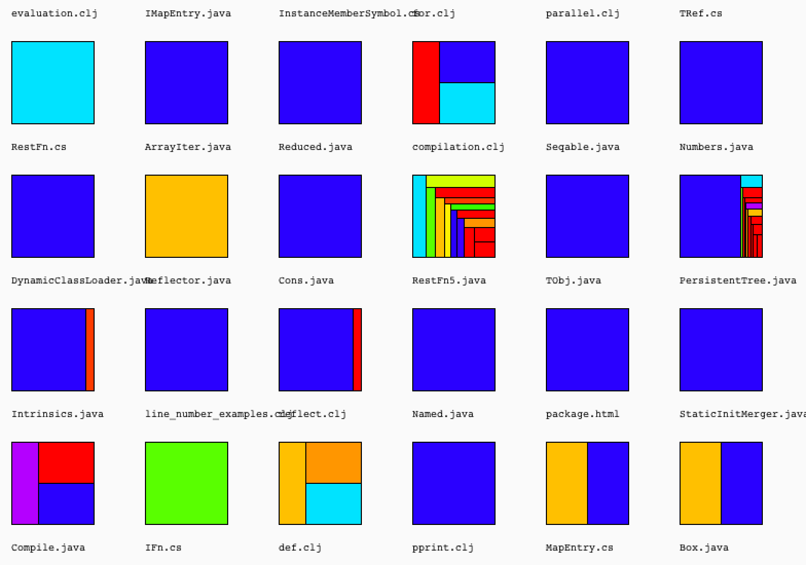

# ownership-fractals

A Quil sketch designed to visualize knowledge ownership.

## Usage

This repo contains my prototype for generating fractal figures from ownership metrics mined by [Code Maat](https://github.com/adamtornhill/code-maat).

Note that the input data has to be cleaned in order to avoid historic (and obsolete) entities.

Here's an example of generated ownership figures:

.

### Interactions

Use the mouse wheel to scroll up and down between the different fractals, one step at a time.

## License

Copyright © 2015 Adam Tornhill

Distributed under the Eclipse Public License version 1.0
